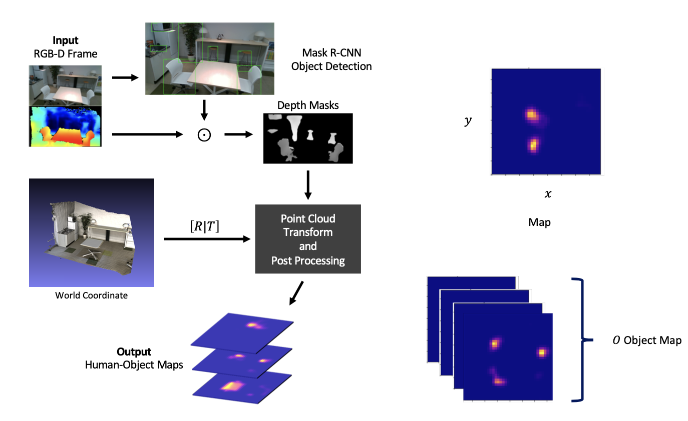

# Action Mapping

This is the code accompanying my paper ["Human-Object Maps for Daily Activity Recognition"](http://www.mva-org.jp/Proceedings/2019/papers/07-02.pdf) (MVA 2019; Oral).

This code contains the pipelines for creating Human-Object Maps (HOMs).

## Pipeline

## Viewer

Opoen3D | Web (threeJS)
:-: | :-:
<video src='.readme/open3d_viewer.mov' width=180/> | <video src='.readme/web_viewer.mov' width=180/>